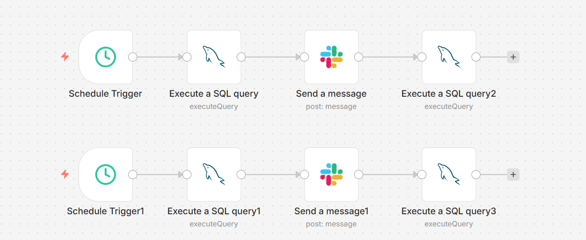
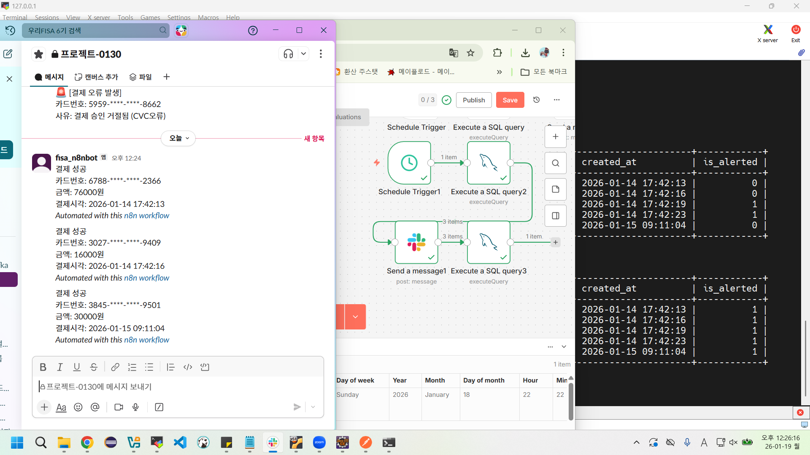

# 💳 가상 카드 결제 알림 시스템 (Virtual Card Payment Notification System)

> **프로젝트 목표**
>
> 본 프로젝트는 지금까지 학습한 **JDBC, MVC 패턴, MySQL, Docker** 기술을 종합적으로 복습하고, **n8n** 자동화 도구를 새롭게 도입하여 가상의 카드 결제 알림 시스템을 구축하는 것을 목적으로 한다. 이를 통해 백엔드 로직 구현부터 데이터베이스 연동, 컨테이너 환경에서의 운영, 그리고 DevOps 관점의 로그 모니터링 및 알림 자동화까지의 전 과정을 경험한다.

---

## 1. 📝 프로젝트 개요

### 1) 팀원 소개

|  |  |  |
| :------------------------------------------------------------------------------------------: | :------------------------------------------------------------------------------------------: | :------------------------------------------------------------------------------------------: |
| **사재헌** | **이명진** | **이채유** |
| [GitHub](https://github.com/Zaixian5) | [GitHub](https://github.com/septeratz) | [GitHub](https://github.com/chaeyuuu) |

### 2) 주제
카드 결제 시 발생하는 로그 데이터를 생성하고, 이를 모니터링하여 **Slack으로 결제 내역(성공/실패)을 실시간 발송**하는 시스템이다.

### 3) 기획 의도
* **🏦 금융 IT 도메인 실습**: 우리 FISA(금융 IT 아카데미)의 특성을 살려 간이 결제 시스템을 구현한다.
* **📚 배운 지식의 활용**: Java로 비즈니스 로직을 구현하고, JDBC를 통해 MySQL과 연동한다. 특히 '로그(Log) 기록'을 DB 기반으로 구현한다는 것에 의의를 둔다.
* **♾️ DevOps 관점 적용**: `Cloud Engineering` 과정의 특성에 맞춰, 단순히 데이터를 쌓는 것을 넘어 로그를 분석하고 오류를 탐지하여 알림을 보내는 자동화 파이프라인을 구축한다.

### 4) 핵심 기술 스택
| 구분 | 기술 | 설명 |
| :-- | :-- | :-- |
| **언어** |  | 결제 로직 구현 및 데이터 생성 |
| **DB** |  | 결제 로그 저장 및 관리 |
| **자동화 툴** |  | DB 모니터링 및 Slack 알림 자동화 |
| **인프라** |  | 애플리케이션 및 DB 컨테이너화 |
| **알림 전송** |  | 알림 수신 채널 |

---

## 2. 🤖 n8n 도입 배경

### 1) n8n이란?
사용자가 코드를 거의 작성하지 않고도 다양한 앱과 서비스를 연결해 업무를 자동화할 수 있는 **워크플로우 자동화 도구**이다. 노드(Node) 기반으로 각 기능을 연결하여 작업 순서를 정의할 수 있다.

### 2) 왜 n8n을 사용하는가?
1.  **DevOps & Backend 자동화**: 서버 모니터링 알림(CloudWatch, Grafana 연동), 간단한 백엔드 API 구성, GitHub 이슈 연동 등 개발 운영 효율을 높이는 데 최적화되어 있다.
2.  **무료 자가 호스팅**: Docker 등을 통해 내 서버에 직접 올려 사용할 경우 비용 없이 활용 가능하다.
3.  **개발자 친화적**: 단순 연결을 넘어 JavaScript를 활용한 복잡한 데이터 가공이 가능하다.
4.  **MCP와의 차별점**: 최근 화두인 MCP(Model-Context Protocol)가 AI와 도구의 연결 표준이라면, n8n은 구체적인 **작업 로직(Workflow)을 실행**하는 데 초점을 맞춘다.

---

## 3. 🏗️ 시스템 아키텍처

본 프로젝트의 모든 서비스(MySQL, n8n)는 **Docker 컨테이너 환경**에서 구동된다.

### 1) 기본 구조
1.  **IDE**: Eclipse
2.  **Build**: Maven
3.  **DB**: MySQL (JDBC 연동)
4.  **Logging**: slf4j + log4j2
5.  **Notification**: n8n Slack Node

### 2) 데이터베이스 스키마
결제 정보를 저장하기 위한 `payment_logs` 테이블 구조는 다음과 같다.

```sql
CREATE TABLE IF NOT EXISTS payment_logs (
    log_id INT AUTO_INCREMENT PRIMARY KEY,
    card_number VARCHAR(20),        -- 카드번호
    amount DECIMAL(10, 0),          -- 결제금액
    merchant_name VARCHAR(50),      -- 가맹점
    status VARCHAR(10),             -- SUCCESS, FAIL
    message VARCHAR(100),           -- 로그 메시지 (에러 원인 등)
    created_at TIMESTAMP DEFAULT CURRENT_TIMESTAMP,    -- 결제 시간
    is_alerted BOOLEAN DEFAULT FALSE -- Slack 알림 발송 여부
);
```

## 4. 💸 결제 메세지 명세

### 1) 가맹점 종류

- 스타벅스
- GS25
- 쿠팡
- 배달의민족
- 카카오택시
- FISA 구내식당

### 2) 결제 실패 사유 종류

- 잔액부족
- 한도초과
- 도난분실카드
- 통신시간초과
- CVC오류

### 3) 결제 성공 예시

| log_id | card_number | amount | merchant_name | status | message | created_at | is_alerted |
| --- | --- | --- | --- | --- | --- | --- | --- |
| 31 | 9448-****-****-1001 | 4000 | woori_atm | SUCCESS | 결제 정상 승인 | 2026-01-15 17:31:154 | FALSE |
| 32 | 4700-****-****-8910 | 12000 | cu | SUCCESS | 결제 정상 승인 | 2026-01-16 09:23:153 | FALSE |

### 4) 결제 실패 예시

| log_id | card_number | amount | merchant_name | status | message | created_at | is_alerted |
| --- | --- | --- | --- | --- | --- | --- | --- |
| 19 | 9448-****-****-1001 | 24000 | emart | FAIL | 잔액부족 | 2026-01-15 17:31:154 | TRUE |
| 20 | 4700-****-****-8910 | 3000 | cu | FAIL | 한도초과 | 2026-01-16 09:23:153 | TRUE |
| 21 | 9448-****-****-1001 | 13000 | woori_atm | FAIL | 도난분실카드 | 2026-01-17 13:17:912 | TRUE |
| 33 | 9448-****-****-1001 | 500000 | netflix | FAIL | 통신시간초과 | 2026-01-17 13:17:912 | TRUE |
| 34 | 3200-****-****-1717 | 1700 | cu | FAIL | CVC오류 | 2026-01-17 13:17:912 | TRUE |

### 5) 슬랙 발송 메시지 예시

```sql
🚨 [결제 오류 발생]
카드번호: 8384-****-****-6028
금액: 36000원
사유: 결제 승인 거절됨 (통신시간초과)
```

```sql
결제 성공
카드번호: 7753-****-****-6977
금액: 85000원
결제시각: 2026-01-19 17:49:01
```
## 5. ⚙️ 환경 구성 (Setup)
### 5.1. Docker 환경 (docker-compose)

#### 1) 가상머신 생성

- ubuntu server 24.04.3

#### 2) docker 설치

```bash
# docker.io 설치
sudo apt update
sudo apt install docker.io

# 로그인(도커 허브 계정)
docker login

# docker-compose 설치(여러 컨테이너를 한 번에 만들어 주는 도구)
sudo apt install docker-compose
```

#### 3) docker-compose.yml 생성

```yaml
version: '3'

services:
  # 1. MySQL 컨테이너
  mysql-db:
    image: mysql:8.0
    container_name: fisa-mysql
    environment:
      MYSQL_ROOT_PASSWORD: root  # 루트 비밀번호
      MYSQL_DATABASE: fisa_db    # 시작할 때 만들 데이터베이스 이름
      TZ: Asia/Seoul             # 시간대를 한국으로 설정
    ports:
      - "3306:3306"              # 외부접속포트:내부포트
    volumes:
      - ./mysql_data:/var/lib/mysql # DB 데이터 보관 장소
    command: --character-set-server=utf8mb4 --collation-server=utf8mb4_unicode_ci # 한글 깨짐 방지

  # 2. n8n 컨테이너
  n8n:
    image: n8nio/n8n
    container_name: fisa-n8n
    ports:
      - "5678:5678"
    environment:
      - N8N_BASIC_AUTH_ACTIVE=true   # 로그인 기능 켜기
      - N8N_BASIC_AUTH_USER=admin    # n8n 아이디 - 실제 사용되지 않음
      - N8N_BASIC_AUTH_PASSWORD=pass # n8n 비밀번호 - 실제 사용되지 않음
      - GENERIC_TIMEZONE=Asia/Seoul  # 시간대 설정
    volumes:
      - ./n8n_data:/home/node/.n8n   # 워크플로우 저장위치
    dns:                             # DNS 주소 지정
      - 8.8.8.8                      # 구글 DNS 1 (Trouble Shooting2 참고)
      - 8.8.4.4                      # 구글 DNS 2
    depends_on:
      - mysql-db                     # DB가 켜진 후 실행
```

#### 4) 컨테이너 생성 및 실행

```bash
docker-compose up -d

# 설치 확인
# 아래 명령어 실행시 fisa-mysql과 fisa-n8n 컨테이너가 표시되어야 함
docker ps
```

> 🚨 **Trouble Shooting1: 권한 문제**\
> docker-compose up -d 후 n8n 컨테이너가 실행되지 않는다면, 로컬의 ./n8n_data 디렉토리 권한 문제일 가능성이 높다. n8n은 기본적으로 워크플로우를 저장하는 ./n8n_data 디렉토리를 root 권한으로 만들기 때문이다. 아래 명령어를 입력해, 해당 디렉토리에 모든 사용자 권한을 추가하여 다시 시도한다.
```bash
sudo chmod -R 777 ./n8n_data
```

#### 5) 가상머신 포트포워딩 설정
> 🚨 **주의사항**
> 게스트 IP는 다를 수 있다. 본인 쉘에서 ip 주소를 필히 확인해야 한다.

| 규칙 명 | 호스트 IP | 호스트 포트 | 게스트 IP(예시) | 게스트 포트 | 비고 |
| --- | --- | --- | --- | --- | --- |
| mysql docker | 127.0.0.1 | 3306 | 10.0.2.15 | 3306 |  |
| n8n docker | 127.0.0.1 | 5678 | 10.0.2.15 | 5678 |  |


### 5.2. DB 환경 구성

- `docker exec -it fisa-mysql mysql -u root -p` 명령으로 도커 컨테이너의 mysql 쉘로 이동
- 아래 쿼리 문을 입력하여 테이블 생성

```sql
USE fisa_db;

CREATE TABLE IF NOT EXISTS payment_logs (
    log_id INT AUTO_INCREMENT PRIMARY KEY,
    card_number VARCHAR(20),
    amount DECIMAL(10, 0),
    merchant_name VARCHAR(50),
    status VARCHAR(10),     
    message VARCHAR(100),           
    created_at TIMESTAMP DEFAULT CURRENT_TIMESTAMP,
    is_alerted BOOLEAN DEFAULT FALSE 
);
```

### 5.3. n8n 환경 구성

#### 1) 컨테이너 실행

```bash
docker-compose up -d
```

#### 2) 브라우저에서 n8n 열기

- 브라우저에 [localhost:5678](http://localhost:5678) 입력

#### 3) 가입

- 메일, 비밀번호, 이름 입력하여 가입
> 이메일 인증 과정은 없으니, 아무렇게나 만들어도 괜찮다.

#### 4) MySQL Credential 추가

1. 좌측 + 버튼 클릭
2. Credential 클릭
3. mysql 검색 후 continue
4. 아래와 같이 입력 후 save
    - Host: `mysql-db`
        - 주의사항: docker는 localhost일지라도 mysql host의 이름을 컨테이너의 이름으로 설정합니다. 반드시 localhost가 아니라 컨테이너 이름으로 입력하세요.
    - Database: `fisa_db`
    - User: `root`
    - Passeord: `root`
    - Port: `3306`

#### 5) Slack API 발급

1. [Slack API 사이트](https://api.slack.com/apps) 접속 -> **Create New App** -> **From scratch**.
2. App Name: (아무거나), 워크스페이스 선택 -> Create.
3. 왼쪽 메뉴 **OAuth & Permissions** 클릭.
4. 아래로 스크롤해서 **Scopes** -> **Bot Token Scopes**에 `chat:write` 권한 추가.
5. 맨 위로 올려서 **Install to Workspace** 클릭 -> 허용.
6. 생성된 **Bot User OAuth Token** (`xoxb-`로 시작하는 값)을 복사
7. n8n으로 돌아와서 **Credentials** -> **Slack API** 추가 -> `Access Token` 란에 붙여넣고 저장.

> 🚨 **Trouble Shooting2: Slack Webhook 사용시 주의사항**\
>n8n에 slack 노드를 연결하는 것이 아니라 Slack api에서 webhook URL을 발급 받고 n8n에서 HTTP Request 노드에 연결하여 사용하는 방법도 있다. 다만 이 방법을 사용할 때, n8n 도커 컨테이너가 DNS 서버를 찾지 못하는 문제가 발생하기도 한다.
>
>`docker-compose down` 명령으로 컨테이너를 멈춘 후, `docker-compose.yml` 에 DNS 주소를 추가하고 다시 `docker-compose up -d` 하니 해결되었다.
>
> 이와 달리 n8n에 Slack 노드를 연결하는 방식에서는 별도의 서버 오류가 발생하지 않았다. 따라서 본 프로젝트에서는 HTTP Request 노드에 Slack webhook URL을 연결하는 것이 아니라, Slack 노드를 연결하는 방식을 사용한다.


#### 6) n8n workflow 구성

1. 결제 오류 발송 노드
    - `schedule trigger` 노드 추가
        - trigger interval: `minutes` (분 단위로 작업을 반복 함)
        - seconds between triggers: `1`(1분 단위로 작업을 반복 함)
    - `mysql: execute a sql query` 노드 추가
        - Query 칸에 아래 sql을 입력
            
            ```sql
            -- 결제 실패 기록을 DB에서 가져옴
            SELECT * FROM payment_logs 
            WHERE (status = 'FAIL' OR status = 'ERROR') 
            AND is_alerted = 0;
            ```
            
    - `slack: send a message` 노드 추가
        - **Credential:** 방금 만든 Slack 계정 선택.
        - **Resource:** `Message`, **Operation:** `Send` , **Send message to** : `Channel`
        - **Channel:** 알림 받을 채널 선택
        - **Message Type**: `Simple text message` 선택 후 아래 텍스트 입력
            
            ```bash
            🚨 [결제 오류 발생]
            카드번호: {{ $json.card_number }}
            금액: {{ $json.amount }}원
            사유: {{ $json.message }}
            ```
            
    - `mysql: execute a sql query` 노드 추가
        - Query 칸에 아래 sql을 입력
            
            ```sql
            -- 알림 보낸 로그 처리완료 표시
            UPDATE payment_logs 
            SET is_alerted = 1 
            WHERE log_id = {{ $('Execute a SQL query').item.json.log_id }};
            ```
            
2. 결제 성공 발송 노드
    - `schedule trigger` 노드 추가
        - trigger interval: `minutes` (분 단위로 작업을 반복 함)
        - seconds between triggers: `10`(10분 단위로 작업을 반복 함)
    - `mysql: execute a sql query` 노드 추가
        - Query 칸에 아래 sql을 입력
            
            ```sql
            -- 결제 성공 기록을 DB에서 가져옴
            SELECT * FROM payment_logs 
            WHERE (status = 'SUCCESS') 
            AND is_alerted = 0;
            ```
            
    - `slack: send a message` 노드 추가
        - **Credential:** 방금 만든 Slack 계정 선택.
        - **Resource:** `Message`, **Operation:** `Send` , **Send message to** : `Channel`
        - **Channel:** 알림 받을 채널 선택
        - **Message Type**: `Simple text message` 선택 후 아래 텍스트 입력
            
            ```bash
            결제 성공
            카드번호: {{ $json.card_number }} 
            금액: {{ $json.amount }}원 
            결제시각: {{ $json.created_at }}
            ```
            
    - `mysql: execute a sql query` 노드 추가
        - Query 칸에 아래 sql을 입력
            
            ```sql
            -- 알림 보낸 로그 처리완료 표시
            UPDATE payment_logs 
            SET is_alerted = 1 
            WHERE log_id = {{ $('Execute a SQL query1').item.json.log_id }};
            ```
            

#### 7) 완성된 n8n 워크플로우 모습



## 6. 💻 핵심 로직 및 세부 사항

### 6.1. 비즈니스 로직(랜덤 결제 기록 생성) 명세


이 프로젝트에 적용된 랜덤 로직은 실제 결제 환경에서 일어날 법한 다양한 상황을 시뮬레이션하기 위해 설계되었다.

단순한 더미 데이터 삽입이 아닌, 실제 존재할 법한 데이터들을 만들어 비즈니스 로직에 맞도록 생성한 뒤 SQL문으로 DB에 삽입하는 것이 목적이다.

아래는 자바의 `java.util.Random` 클래스를 사용하여 구현된 4가지 핵심 로직이다.

---


#### 1) 장애 발생 시뮬레이션 (확률 제어 로직)

이 프로젝트에서 가장 중요한 부분이다. n8n이 **"에러를 감지하고 슬랙을 보내는지"** 테스트하려면, 가끔 에러가 터져야 한다.

```java
boolean isFail = random.nextInt(5) == 0;
```

- **작동 원리:**
    - `random.nextInt(5)`는 `0` 이상 `5` 미만의 정수를 반환한다. (즉, 0, 1, 2, 3, 4 중 하나)
    - 5개의 숫자 중 `0`이 나올 확률은 수학적으로 **1/5**, 즉 **20%** 이다.
- **의미:**
    - 결제 5건 중 약 1건 꼴로 고의적인 결제 실패(FAIL)를 발생시킨다.
    - 나머지 80%는 정상 승인(SUCCESS)으로 처리된다.
    - 이 비율을 조절하고 싶다면 `nextInt(10)`으로 바꾸면 10% 확률이 되고, `nextInt(5) <= 1;` 과 같이 조건문 범위를 조절하면 40%가 된다.

---


#### 2) 결제 금액 랜덤 생성

1원, 2원 같은 비현실적인 금액이 아니라, 실제 카드 결제처럼 보이는 금액을 만든다.

```java
int amount = (random.nextInt(100) + 1) * 1000;
```

- **작동 원리:**
    - `nextInt(100)`: 0부터 99까지의 숫자를 뽑는다.
    - `+ 1`: 0원을 방지하고 최소 1단위를 만든다. (1~100)
    - `1000`: 천 원 단위로 만든다.
- **결과:** 최소 1,000원에서 최대 100,000원 사이의 금액이 1,000원 단위로 생성된다. (예: 15,000원, 42,000원)

---


#### 3) 가맹점 및 에러 사유 랜덤 선택 (배열 인덱싱)

실제 존재하는 상호명과 존재할 법한 오류명들을 미리 만들어 둔 배열에서 랜덤으로 뽑고, 조합하여 결제 기록을 생성한다.

```java
String[] merchants = {"스타벅스", "GS25", "쿠팡", ...};
return merchants[random.nextInt(merchants.length)];
```

- **작동 원리:**
    - 배열에 데이터가 6개 있다면 `length`는 6이다.
    - `nextInt(6)`은 `0`부터 `5` 사이의 인덱스 번호를 준다.
    - `merchants[2]` 와 같은 값이 나오며, 랜덤한 위치의 가게 이름을 꺼낸다.
- **결과:** 6개의 가맹점 중 하나가 랜덤으로 나온다.
- **에러 코드("잔액부족", "한도초과" 등)** 도 똑같은 방식으로 선택된다.

---


#### 4) 카드 번호 생성 (문자열 포맷팅)

개인정보 보호를 위해 가운데 숫자를 가린(Masking) 카드 번호를 생성한다.

```java
String.format("%04d-****-****-%04d", 
        random.nextInt(9000) + 1000,  // 앞 4자리
        random.nextInt(9000) + 1000); // 뒤 4자리
```

- **작동 원리:**
    - `nextInt(9000)`: 0 ~ 8999 사이의 랜덤한 정수가 나온다.
    - `+ 1000`: 더하면 **1000 ~ 9999** 범위가 된다. (무조건 4자리 숫자 보장)
- **결과:** `1234-****-****-5678` 형태의 카드 번호 문자열이 완성된다.

---


#### 5) 예시: 이 로직이 만드는 시나리오

이 Java 코드가 실행되는 동안 다음과 같은 일이 무작위로 반복된다.

1. **80% 확률로:** "스타벅스"에서 "15,000원" 결제 **성공** (로그: INFO) → **DB 저장** → n8n에서 **성공 파이프라인 작동** → **슬랙 메시지 발송**
2. **20% 확률로:** "쿠팡"에서 "52,000원" 결제 **실패**, 사유는 "잔액부족" (로그: WARN) → **DB 저장** → n8n에서 **실패 파이프라인 작동** → **🚨 슬랙 메시지 발송**


### 6.2. 디자인 패턴 명세

#### 1) MVC 패턴이란

**MVC(Model-View-Controller)** 패턴은 애플리케이션의 구성 요소를 세 가지 역할로 구분하여 개발 및 유지보수의 효율성을 높이는 소프트웨어 디자인 패턴이다.

- **Model (모델)**: 애플리케이션의 **데이터**와 **비즈니스 로직**을 담당한다. 데이터베이스의 상태를 관리하고, 시스템의 핵심 규칙을 처리하는 부분이다.
- **View (뷰)**: 사용자에게 보여지는 **화면(UI)** 을 담당한다. 모델이 처리한 데이터를 시각적으로 표현하거나, 사용자에게 알림을 출력하는 역할이다.
- **Controller (컨트롤러)**: 사용자의 **요청(Input)** 을 받아 모델과 뷰를 연결하는 **지휘자** 역할을 한다. 무엇을 처리할지 모델에게 지시하고, 그 결과를 어떤 뷰로 보여줄지 결정한다.

#### 2) MVC 패턴을 사용한 이유

1. **관심사의 분리 (Separation of Concerns)**
    - 랜덤 데이터를 생성하는 로직(Service), DB에 저장하는 로직(DAO), 결과를 출력하는 로직(View)이 섞이지 않도록 분리하여 코드의 가독성을 높인다.
2. **유지보수 및 확장성**
    - 추후 DB가 변경되더라도 비즈니스 로직(Service)은 수정할 필요 없이 DAO만 수정하면 된다.
    - 콘솔 출력 대신 웹 화면으로 확장하더라도 View 계층만 교체하면 되므로 유연한 확장이 가능하다.
        - 현재 프로젝트는 view를 단순히 콘솔 출력으로 구현하였다.
3. **협업 효율성**
    - 데이터 구조(DTO)와 로직(Service), 화면(View)이 분리되어 있어, 각 컴포넌트별로 명확한 역할 정의가 가능하다.

#### 3) 프로젝트 디렉토리 구조

```
n8n_project
   +---src
   |   +---controller
   |   |       PaymentController.java
   |   |
   |   +---model
   |   |   +---dao
   |   |   |       PaymentLogsDAO.java
   |   |   |
   |   |   +---domain
   |   |   |       PaymentLogsDTO.java
   |   |   |       RanDataDTO.java
   |   |   |
   |   |   \---service
   |   |           PaymentService.java
   |   |
   |   +---util
   |   |       DBUtil.java
   |   |       RandomUtil.java
   |   |
   |   \---view
   |           PaymentFailView.java
   |           PaymentStartView.java
               PaymentSuccessView.java
   ...
```

#### 4) 프로젝트에서 각 요소(Model, View, Controller)의 역할

#### 🟢 Model (Data & Business Logic)

시스템의 핵심 코어로서 데이터와 로직을 전담한다. 본 프로젝트에서는 `model` 패키지 하위에 `dao`, `domain`, `service`를 두어 관리한다.

- **domain (DTO)**
    - `PaymentLogsDTO.java`: 데이터베이스의 `payment_log` 테이블과 1:1로 매핑되는 데이터 전송 객체이다.
    - `RanDataDTO.java`: 랜덤 데이터 저장을 위한 필드를 담는 객체다.
- **dao (Data Access Object)**
    - `PaymentLogsDAO.java`: 데이터베이스(MySQL)에 직접 연결하여 `INSERT` SQL 쿼리를 실행하는 역할을 수행한다.
- **service (Business Logic)**
    - `PaymentService.java`: `RandomUtil`을 이용해 결제 정보를 무작위로 생성하고, 생성된 데이터를 `PaymentLogsDAO`에게 전달하여 저장을 요청하는 핵심 비즈니스 로직을 수행한다.

#### 🔵 View (User Interface)

사용자(개발자/관리자)에게 시스템의 동작 상태를 시각적으로 전달한다.

- `PaymentStartView.java`: 앱의 시작점으로, 시작을 알려주는 문장을 출력한다.
- `PaymentSuccessView.java`: 데이터가 DB에 정상적으로 저장되었을 때, 성공 메시지를 출력한다.
- `PaymentFailView.java`: DB 연결 실패나 저장 오류 발생 시, 에러 메시지를 출력한다.

#### 🔴 Controller

모델과 뷰를 연결하며, 프로젝트의 전체 흐름을 제어한다.

- `PaymentController.java`
    - `PaymentService`를 호출하여 비즈니스 로직(데이터 생성 및 저장)을 수행하도록 지시한다.
    - 수행 결과에 따라 `PaymentSuccessView` 또는 `PaymentFailView`를 선택하여 결과를 화면에 띄운다.

#### 🟡 Util

프로젝트 전반에서 공통적으로 사용되는 기능을 제공한다.

- `DBUtil.java`: JDBC 드라이버 로딩 및 Connection 객체 생성/반환 등 중복되는 DB 연결 코드를 담당한다.
- `RandomUtil.java`: 상점 이름, 결제 상태, 카드 번호 등을 무작위로 추출하는 로직을 제공하여 `Service`의 코드를 간결하게 만든다.

## 7. 📸 프로젝트 결과 화면
> Java 프로그램이 실행되는 동안 정상적으로 MySQL에 카드 결제 기록이 저장되고, n8n 워크플로우가 정상적으로 작동된다. 또한 주기적으로 Slack 채널에 결제 기록이 도착하고, 결제 오류 발생시 즉시 메시지가 도착하는 모습이다.



---
